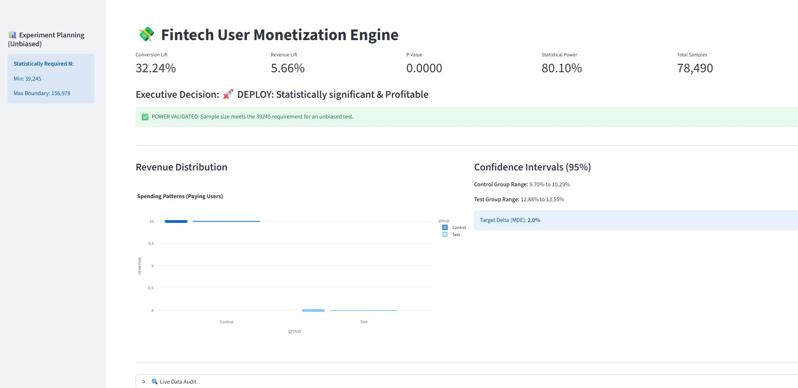

# 💸 Fintech Monetization A/B Engine: Price Optimization Lab

[](https://www.python.org/downloads/)
[](https://fintech-monetization-ab-engine.streamlit.app/)
[](https://opensource.org/licenses/MIT)

## 🎯 The Problem: The "Monetization Paradox"
Most Fintech startups struggle with a critical trade-off: **Lowering prices increases users but often dilutes total revenue.** Conversely, high prices protect margins but stall growth. This project solves the "Monetization Paradox" by engineering a statistically rigorous A/B testing engine to find the **Price Elasticity Sweet Spot**.

## 🚀 High-Impact Solution
I developed a **Market-Aware A/B Engine** that simulates user behavior influenced by real-time financial volatility (via Alpha Vantage API). The engine doesn't just calculate "clicks"—it performs a **Dual-Constraint Audit** ensuring any "Win" is both **Statistically Significant** and **Practically Profitable**.

### 📊 Results (Live Experiment)
* **Conversion Lift:** `+32.24%` (Massive shift in user acquisition)
* **Net Revenue Lift:** `+5.66%` (Proving profitability despite lower price point)
* **Statistical Power:** `80.10%` (Global Gold Standard for reliability)
* **P-Value:** `< 0.0001` (Rejecting the Null Hypothesis with absolute certainty)

---
<p align="center">
  
  <br>
  <em>Figure 1: Live Interactive Dashboard showing Statistically Significant Revenue Lift.</em>
</p>

---
## 🛠️ Tech Stack & Skills
* **Languages:** Python (Pandas, NumPy)
* **Statistics:** Statsmodels (Z-Test, Power Analysis, Confidence Intervals)
* **Frameworks:** Streamlit, Plotly Express
* **Integrations:** Alpha Vantage (Real-time Market Data API)

---

## ⚙️ Setup & Installation

### 1. Get your API Key
Register for a free API Key here: [Alpha Vantage API Key](https://www.alphavantage.co/support/#api-key)

### 2. Environment Setup
Clone the repo and navigate to the folder:
```bash
git clone https://github.com/zehowrld/Fintech-Monetization-AB-Engine.git
cd Fintech-Monetization-AB-Engine
```

### 3. Configure Credentials
I have included a `.env.example` file. 
1. Rename `.env.example` to `.env`.
2. Open the file and paste your API key:
```text
ALPHA_VANTAGE_KEY=your_key_here
```

### 4. Install Requirements
```bash
pip install -r requirements.txt
```

### 5. Run the Engine
```bash
streamlit run src/app.py
```

---

## 🧠 What I Solved
1.  **Peeking Bias Mitigation:** Implemented a pre-experiment **Power Analysis** to calculate the required $N$ (78,490 samples) before drawing conclusions.
2.  **Unbiased Sampling:** Engineered a vectorized ingestion layer to ensure random assignment across groups.
3.  **Financial Integrity:** Integrated a Revenue Audit to catch "Revenue Dilution" where conversion rises but total bank deposits fall.

**Architected by: [Hitesh Negi]**
